# Restaurant Reviews Classification
1. This project uses Natural Language Processing and various Classification models to analyze and learn from the dataset consisting of past reviews of a restaurant. These reviews are classified as being positive or negative. The models can then be used to predict if any future review for that restaurant is a positive review or a negative one. 
2. Logistic Regression Classification model performed best in this project.
3. Listed below are the Confusion Matrix and Classification Report of the various Classification models used in this project, arranged in order of decreasing accuracy:    

## Logistic Regression

**Confusion Matrix**    

**Classification Report**    

## K Nearest Neighbors Classifier   

**Confusion Matrix**    
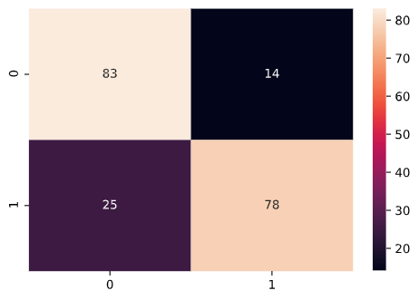

**Classification Report**    
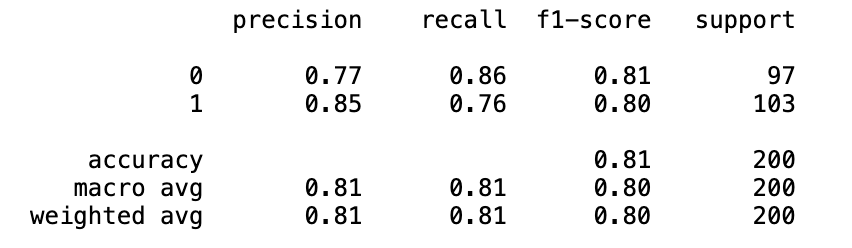    

## Support Vector Machine    

**Confusion Matrix**    
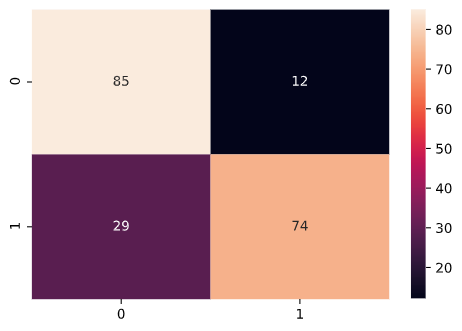  

**Classification Report**    
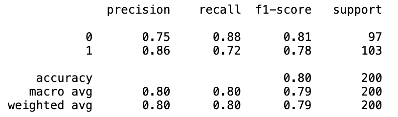    

## Random Forest    

**Confusion Matrix**    
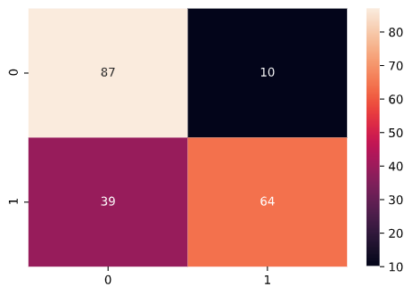  

**Classification Report**    
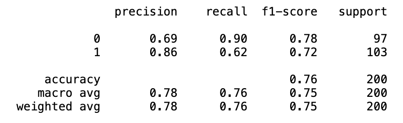    

## Kernel SVM    

**Confusion Matrix**    
  

**Classification Report**    
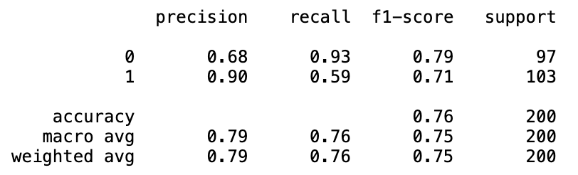    

## Decision Tree    

**Confusion Matrix**    
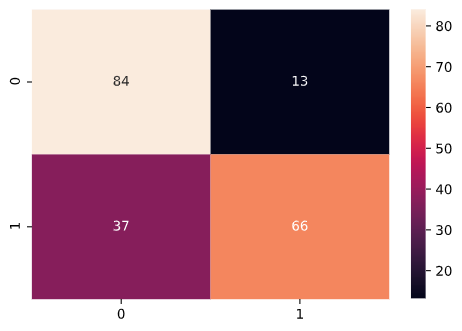  

**Classification Report**    
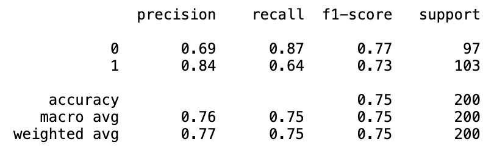    

## Naive Bayes    

**Confusion Matrix**    
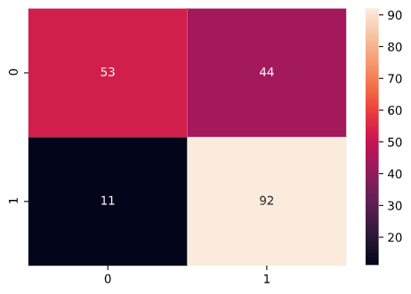  

**Classification Report**    
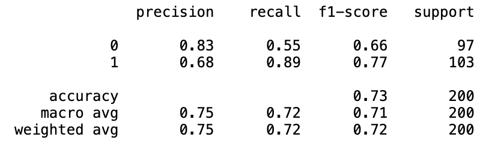

