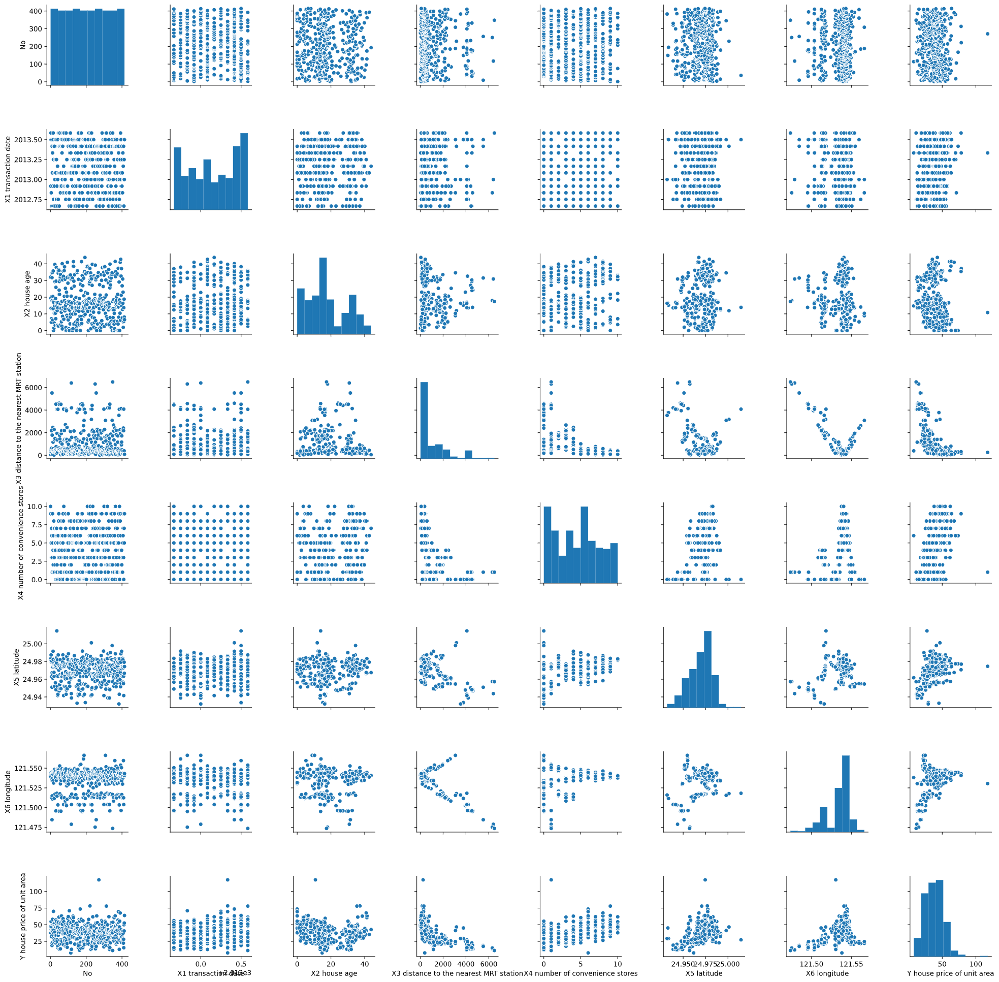

# Housing_Prices

* The goal of this project is to predict the housing price using various regression models.  
* The dataset was taken from kaggle and the link to the dataset can be found here [kaggle](https://www.kaggle.com/rhuebner/human-resources-data-set)
* Just as an overview of the dataset, one can look at the pairplot figure of all the variables in the dataset below.

