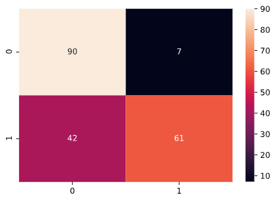

# Restaurant Reviews Classification

1. This project uses Natural Language Processing and various Classification models to classify the reviews of a restaurant as being positive or negative.
2. Listed below are the Confusion Matrix and Classification Report of the various Classification models used in this project, arranged in order of decreasing accuracy:    

## Logistic Regression

**Confusion Matrix**    

**Classification Report**    

## K Nearest Neighbors Classifier   

**Confusion Matrix**    

**Classification Report**    
    

## Support Vector Machine    

**Confusion Matrix**    
  

**Classification Report**    
    

## Random Forest    

**Confusion Matrix**    
  

**Classification Report**    
    

## Kernel SVM    

**Confusion Matrix**    
  

**Classification Report**    
    

## Decision Tree    

**Confusion Matrix**    
  

**Classification Report**    
    

## Naive Bayes    

**Confusion Matrix**    
  

**Classification Report**    

